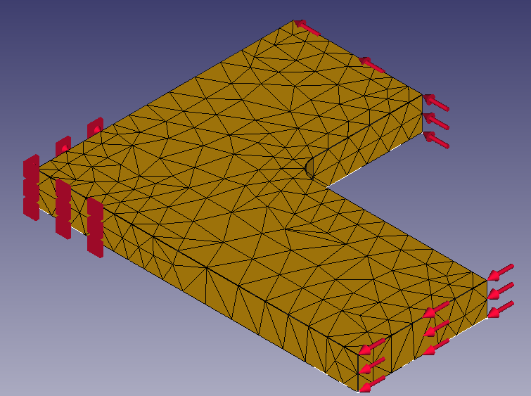

# g2-MLP

[](https://paperswithcode.com/sota/node-classification-on-ppi?p=a-proposal-of-multi-layer-perceptron-with)

This is an implementation of g2-MLP.

## paper details

[A Proposal of Multi-Layer Perceptron with Graph Gating Unit for Graph Representation Learning and its Application to Surrogate Model for FEM](https://www.jstage.jst.go.jp/article/pjsai/JSAI2022/0/JSAI2022_1G4OS22a03/_article/-char/ja/)

GNNs are the neural networks for the representation learning of graph-structured data, most of which are constructed by stacking graph convolutional layers. As stacking n-layers of ones is equivalent to propagating n-hop of neighbor nodes' information, GNNs require enough large number of layers to learn large graphs. However, it tends to degrade the model performance due to the problem called over-smoothing. In this paper, by presenting a novel GNN model, based on stacking feedforward neural networks with gating structures using GCNs, I tried to solve the over-smoothing problem and thereby overcome the difficulty of GNNs learning large graphs. The experimental results showed that the proposed method monotonically improved the prediction accuracy up to 20 layers without over-smoothing, whereas the conventional method caused it at 4 to 8 layers. In two experiments on large graphs, the PPI dataset, a benchmark for inductive node classification, and the application to the surrogate model for finite element methods, the proposed method achieved the highest accuracy of the existing methods compared, especially with a state-of-the-art accuracy of 99.71% on the PPI dataset.

## Results

### PPI (iductive node classification)

| Model | micro-F1 |
| ---- | ---- |
| GAT | 94.17% (±2.20) |
| GCN | 80.74% (±0.69) |
| MLP (20 layers, pb 0.8, 1500 epochs) | 83.126% (±0.036) |
| g2-MLP (4 layers, pb 0.8, 1500 epochs) | 99.531% (±0.018) |
| g2-MLP (8 layers, pb 0.8, 1500 epochs) | 99.663% (±0.009) |
| g2-MLP (12 layers, pb 0.8, 1500 epochs) | 99.689% (±0.007) |
| g2-MLP (16 layers, pb 0.8, 1500 epochs) | 99.699% (±0.013) |
| g2-MLP (20 layers, pb 0.8, 1500 epochs) | 99.705% (±0.014) |
| g2-MLP (24 layers, pb 0.8, 1500 epochs) | 99.700% (±0.006) |
| g2-MLP (20 layers, pb 0.6, 1500 epochs) | 99.690% (±0.013) |
| g2-MLP (20 layers, pb 1.0, 1500 epochs) | 99.598% (±0.012) |

<details>
<summary>hyper parameters</summary>
<div>

| parameters | value |
| ---- | ---- |
| batch size | 64 |
| lr | 2.5e-3 |
| beta | (0.9, 0.9) |
| lr_decay_gamma | 0.3 |
| lr_decay_iters | 300 |
| fnn hidden dim | 2048 |
| hidden dim | 128 |

</div>
</details>


### FEM (inductive node classification)

| Model | micro-F1 | details |
| ---- | ---- | ---- |
| GAT (4 layers, 512 hidden_dim, 100 epochs) | 39.56% (±0.04) | 39.55<br>39.53<br>39.63<br>39.55<br>39.52 |
| GCN (4 layers, 512 hidden_dim, 100 epochs) | 40.60% (±0.17) | 40.69<br>40.72<br>40.70<br>40.27<br>40.62 |
| MLP (12 layers, pb 0.8, 1500 epochs) | 43.42% (±0.30) | 43.73<br>42.96<br>43.69<br>43.53<br>43.19 |
| g2-MLP (12 layers, pb 0.8, 1500 epochs) | 70.49% (±0.75) | 69.68<br>71.04<br>71.68<br>69.88<br>70.18 |

<details>
<summary>hyper parameters</summary>
<div>

| parameters | value |
| ---- | ---- |
| batch size | 512 |
| lr | 2.5e-3 |
| beta | (0.9, 0.9) |
| lr_decay_gamma | 0.3 |
| lr_decay_iters | 300 |
| fnn hidden dim | 2048 |
| hidden dim | 128 |

</div>
</details>

<details>
<summary>About FEM dataset</summary>
<div>

The fillet structure like the follows



We prepared 229 datasets in the following conditions.

TODO : translate

- 各長方形の高さをそれぞれ 10 ~ 100 (10刻み) でランダムに変更
- フィレット径を 5 ~ 45 (5刻み) でランダムに変更

このうち、8割をtrain, 1割をvalidation, 1割をtestとした

./docs/FEMMeshNetgen.frd にあるようなCalculixの計算結果をパースした.

特徴量には次のDisp. を利用している. (TODO : dispとは?)

```
 -4  DISP        4    1
 -5  D1          1    2    1    0
 -5  D2          1    2    2    0
 -5  D3          1    2    3    0
 -5  ALL         1    2    0    0    1ALL
 -1         1-1.23851E-03 1.38397E-03 8.13754E-06
 -1         2-1.23833E-03 1.38748E-03 1.65606E-05
 -1         3-1.23595E-03 1.86246E-03 1.33735E-05
 ...
```

また、次のノードの座標も取得し、正規化した上で特徴量として取り入れている.

```
    2C                          1242                                     1
 -1         1 2.30000E+01 2.00000E+01 5.00000E+00
 -1         2 2.30000E+01 2.00000E+01 0.00000E+00
 -1         3 3.00000E+01 2.00000E+01 5.00000E+00
 -1         4 3.00000E+01 2.00000E+01 0.00000E+00
 -1         5 3.00000E+01 0.00000E+00 5.00000E+00
```

予測対象は次の応力Stress. を、応力の大きさ ( $\sqrt(SXX^2 + SYY^2 + SZZ^2)$ ) にしたものを利用している.

また、予測は数値を直接予測するのではなく、 $2^n$ でbinningし (今回は $2^0$ から $2^4$ )、クラス分類のタスクとした.

(ex : `[0.1, 7, 3, 18, 2]` -> `[0, 3, 2, 5, 1]`)

```
 -4  STRESS      6    1
 -5  SXX         1    4    1    1
 -5  SYY         1    4    2    2
 -5  SZZ         1    4    3    3
 -5  SXY         1    4    1    2
 -5  SYZ         1    4    2    3
 -5  SZX         1    4    3    1
 -1         1 3.68768E-01 8.27878E-03-2.20199E-02-1.50879E-01 2.03513E-03 3.27718E-02
 -1         2 3.52119E-01 1.33049E-02-2.21362E-02-1.71304E-01 8.95834E-03-4.10380E-02
 -1         3 3.28198E-03-6.22315E-03 1.52381E-03-3.40027E-03-1.19905E-03-2.91369E-04
 -1         4-3.29518E-03-8.83664E-03 1.10334E-03 3.01675E-03 7.87600E-04 5.29066E-04
```

ノード間の結合は、次のような正四面体要素であることを踏まえて、正四面体構成ノードのrawデータからパースした


```
    3C                           605                                     1
 -1       483    6    0    1
 -2        23       142        24        52       810       811       228       793       525       797
 -1       484    6    0    1
 -2       142        80        24        52       812       785       811       525       795       797
 -1       485    6    0    1
 -2       119       128       180       181       469       813       815       816       814       659
```

</div>
</details>


### NCI1 (inductive graph classification)

| Model | Accuracy | details |
| ---- | ---- | ---- |
| SAGPool | 74.18% |
| GIN-0 | 82.7% |
| PSCN | 78.59% |
| GK | 62.28 |
| g2-MLP (4 layers, pb 1.0, 100 epochs) | 82.38% (±0.76) | 82.48<br>83.21<br>83.21<br>81.51<br>81.51 |

<details>
<summary>ハイパラ詳細</summary>
<div>

| parameters | value |
| ---- | ---- |
| batch size | 256 |
| lr | 2.5e-3 |
| beta | (0.9, 0.9) |
| fnn hidden dim | 512 |
| hidden dim | 32 |

</div>
</details>


### PTC_MR (inductive graph classification)

| Model | Accuracy | details |
| ---- | ---- | ---- |
| U2GNN | 69.93% | |
| GAT | 66.70% | |
| GIN-0 | 64.6% | |
| PSCN | 62.29% | |
| GK | 57.26% | |
| g2-MLP (4 layers, 50 epochs) | 68.00% (±2.14) | 71.43<br>68.57<br>65.71<br>68.57<br>65.71 |

<details>
<summary>ハイパラ詳細</summary>
<div>

| parameters | value |
| ---- | ---- |
| batch size | 2048 |
| lr | 1.18e-4 |
| beta | (0.9, 0.9) |
| fnn hidden dim | 1024 |
| hidden dim | 128 |

</div>
</details>


### PROTEINS (inductive graph classification)

| Model | Accuracy | details |
| ---- | ---- | ---- |
| U2GNN | 78.53% | |
| SAGPool | 71.86% | |
| GCN | 75.65% | |
| GAT | 74.70% | |
| GIN-0 | 76.2% | |
| PSCN | 75.89% | |
| GK | 71.67% | |
| g2-MLP | 74.11% (±1.41) | |

## Dataset

| Dataset | PPI | NCI1 | PTC_MR | PROTEINS |
| ---- | ---- | ---- | ---- | ---- |
| Graphs | 24 | 4110 | 344 | 1113 |
| Average Nodes Per Graph | 2373 | 29.87 | 14.29 | 39.06 |
| Average Edges Per Graph | 34113 | 32.30 |14.69 | 72.82 |
| Features of Nodes | 50 | | | |
| Classes | 121 (multilabel) | 2 | 2 | 2 |

## Model

### Graph Attention Networks (GAT; 2017)

Reference : [Graph Attention Networks](https://arxiv.org/abs/1710.10903)

### Graph Convolution Networks (GCN; 2016)

Reference : [Semi-Supervised Classification with Graph Convolutional Networks](https://arxiv.org/abs/1609.02907)

## Preparation

1. install dependent packages

	```bash
	$ pip3 install torch==1.9.1
	$ pip3 install -r requirements.txt
	```

2. download necessary data

	```bash
	$ make
	```

## Usage

### train

```bash
$ ./scripts/ppi_gat.sh
```

### view tuning result on optuna-dashboard

```bash
$ optuna-dashboard sqlite:///db.sqlite3
```


## Troubleshooting

<details><summary> `libcudart.so.9.0: cannot open shared object file: No such file or directory` </summary>
<div>

- pytorch-geometricのバージョンをドキュメントに従って揃える
	- https://pytorch-geometric.readthedocs.io/en/latest/notes/installation.html
- nvidia-toolkitのインストール
	- https://developer.nvidia.com/cuda-downloads
- 環境変数の設定
	- https://stackoverflow.com/questions/58127401/libcudart-so-9-0-cannot-open-shared-object-file-no-such-file-or-directory

</div>
</details>


<details><summary> `libtorch_cuda_cpp.so: cannot open shared object file: No such file or directory` </summary>
<div>

- pytorchのバージョンがあっていない
- torch==1.9.1をインストール後、案内に従って残りのライブラリをインストール

```bash
$ python -c "import torch; print(torch.__version__)"
1.9.1
$ python -c "import torch; print(torch.version.cuda)"
cu10.2
$ export TORCH=1.9.1
$ export CUDA=cu102
$ pip install torch-scatter -f https://data.pyg.org/whl/torch-${TORCH}+${CUDA}.html
$ pip install torch-sparse -f https://data.pyg.org/whl/torch-${TORCH}+${CUDA}.html
$ pip install torch-geometric
```

</div>
</details>

## References

- [PyTorch Documentation](https://pytorch.org/docs/stable/index.html)
- [PyTorch-Geometric Documentation](https://pytorch-geometric.readthedocs.io/en/latest/)
- [DGCNN implementation by leftthomas](https://github.com/leftthomas/DGCNN)
- [HGP-SL implementation by cszhangzhen](https://github.com/cszhangzhen/HGP-SL)

## Author

Yu, Nakai. The University of Tokyo.

Contact : nakai-yu623@g.ecc.u-tokyo.ac.jp
